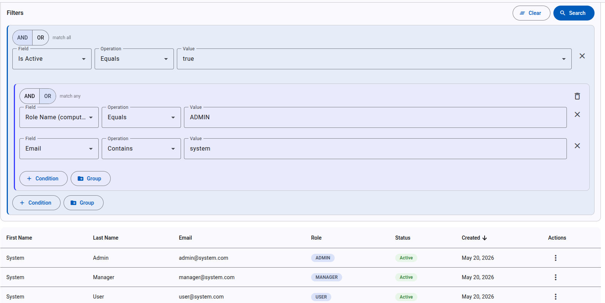
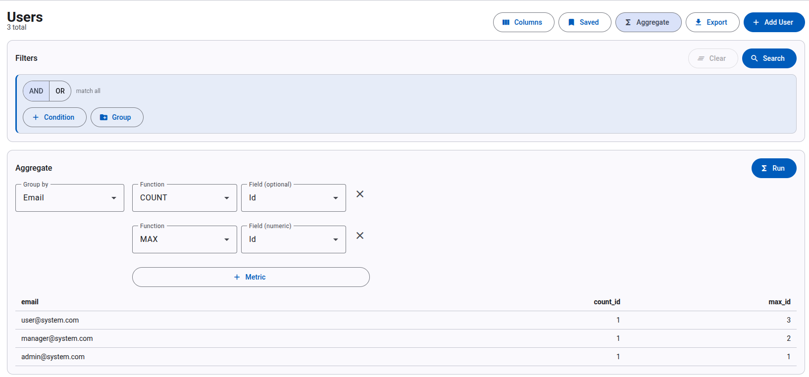
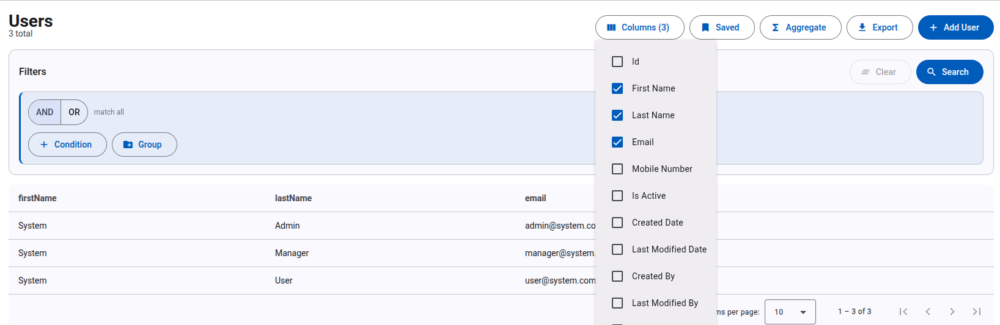
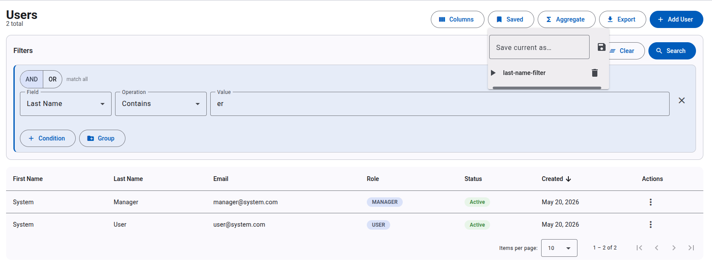

# QuerydslAdmin — the Angular UI

A **metadata-driven Angular 21** admin UI for the [`generic-querydsl`](https://github.com/aalmahmoud/query-builder-be) JSON query engine. Field lists, operations, types, and even which columns are filterable all come from the backend's `/{entity}/metadata` endpoint — **zero hard-coded field lists**, every entity (User / Role / Permission) gets the full toolset.

   

🔌 **Backend:** **[query-builder-be](https://github.com/aalmahmoud/query-builder-be)** — the engine plus its Spring Boot reference app.

---

## ✨ What's in the box

> _Screenshots — drop captures into `docs/screenshots/` (filenames below)._

| | |
|:--:|:--:|
|  |  |
| **Recursive AND / OR query builder** | **Group-by aggregations** |
| Nested boolean groups with type-aware operations, all rendered from `/metadata`. | Group by any field, add `COUNT/SUM/AVG/MIN/MAX` metrics; results flow into a flat table. |
|  |  |
| **Projection (sparse fieldsets)** | **Saved queries** |
| Tick the columns you want; the list switches to a flat projected view. | Save the current builder state by name; reload or delete from the menu. |

📖 **Guided walkthrough:** [docs/DEMO.md (in backend repo)](https://github.com/aalmahmoud/query-builder-be/blob/feature/legendary-query-engine/docs/DEMO.md)
📋 **Shared contract:** [docs/CONTRACT.md (in backend repo)](https://github.com/aalmahmoud/query-builder-be/blob/feature/legendary-query-engine/docs/CONTRACT.md)

---

## Stack

- **Angular 21** — standalone components, **Signals** for state
- **Material MDC** for UI primitives
- **RxJS** with the `takeUntilDestroyed` pattern
- Recursive query-builder template via `ngTemplateOutlet` (no self-import)
- Per-feature lazy routes, JWT HTTP interceptor

---

## Architecture

```
features/
  users / roles / permissions/
    *-list.component.ts       ← metadata-driven list page (filter + project + aggregate + saved)
    *-form.component.ts       ← create / edit
shared/components/
  query-builder/              ← recursive AND/OR builder (self-recursive via templates)
  aggregation-panel/          ← group-by + metrics editor + result table
core/
  models/query.model.ts       ← v2 contract types: QueryRequest, QueryGroup, FieldMeta, …
  services/                   ← entity services: metadata, query, queryProjected, aggregate, savedQueries
```

The three list pages are intentionally structurally identical — that's the point. Add a new entity on the backend, configure the same shell, and you get the same page for free.

---

## Run locally

```bash
npm install
npm start                     # http://localhost:4200
```

The backend API base URL is configured in `src/environments/`. The backend ([query-builder-be](https://github.com/aalmahmoud/query-builder-be)) needs to be running on `localhost:8080`. Seeded login: `admin@system.com` / `admin123`.

---

## Build & test

```bash
ng build                      # production build to dist/
ng test                       # Vitest unit tests
ng e2e                        # e2e (framework of your choice)
```

---

## Author

**Abdullah Almahmoud**  ·  [LinkedIn](https://sa.linkedin.com/in/asalmahmoud)  ·  [GitHub @aalmahmoud](https://github.com/aalmahmoud)

---

## License

Apache 2.0
